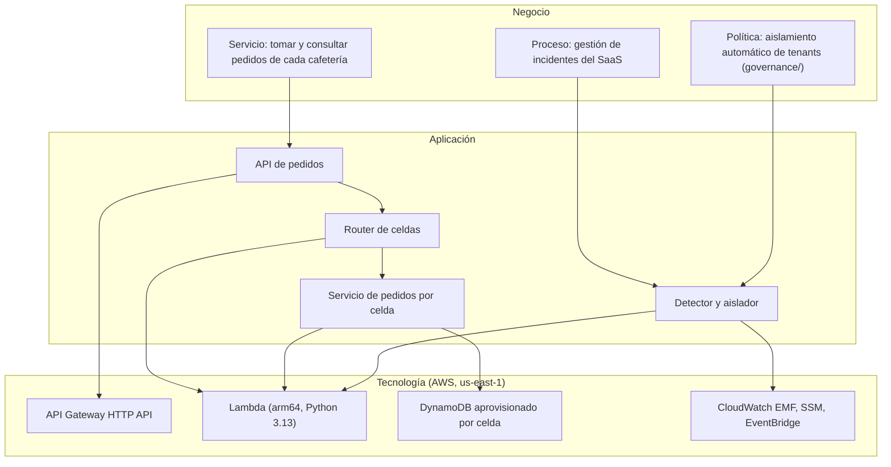
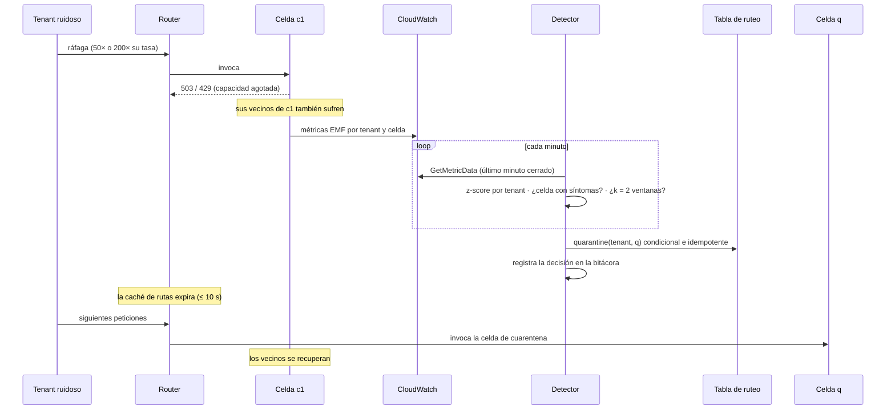

# Vista por capas y secuencia de la cuarentena

## Capas (estilo ArchiMate: negocio, aplicación, tecnología)

```mermaid
flowchart TB
  subgraph negocio["Negocio"]
    b1["Servicio: tomar y consultar pedidos de cada cafetería"]
    b2["Proceso: gestión de incidentes del SaaS"]
    b3["Política: aislamiento automático de tenants (governance/)"]
  end
  subgraph aplicacion["Aplicación"]
    a1["API de pedidos"]
    a2["Router de celdas"]
    a3["Servicio de pedidos por celda"]
    a4["Detector y aislador"]
  end
  subgraph tecnologia["Tecnología (AWS, us-east-1)"]
    t1["API Gateway HTTP API"]
    t2["Lambda (arm64, Python 3.13)"]
    t3["DynamoDB aprovisionado por celda"]
    t4["CloudWatch EMF, SSM, EventBridge"]
  end
  b1 --> a1 --> a2 --> a3
  b2 --> a4
  b3 --> a4
  a1 --> t1
  a2 & a3 & a4 --> t2
  a3 --> t3
  a4 --> t4
```

## Secuencia: detección y cuarentena de un tenant ruidoso

```mermaid
sequenceDiagram
  participant T as Tenant ruidoso
  participant R as Router
  participant C1 as Celda c1
  participant CW as CloudWatch
  participant D as Detector
  participant RT as Tabla de ruteo
  participant Q as Celda q
  T->>R: ráfaga (50× o 200× su tasa)
  R->>C1: invoca
  C1-->>R: 503 / 429 (capacidad agotada)
  Note over C1: sus vecinos de c1 también sufren
  C1->>CW: métricas EMF por tenant y celda
  loop cada minuto
    D->>CW: GetMetricData (último minuto cerrado)
    D->>D: z-score por tenant · ¿celda con síntomas? · ¿k = 2 ventanas?
  end
  D->>RT: quarantine(tenant, q) condicional e idempotente
  D->>D: registra la decisión en la bitácora
  Note over R: la caché de rutas expira (≤ 10 s)
  T->>R: siguientes peticiones
  R->>Q: invoca la celda de cuarentena
  Note over C1: los vecinos se recuperan
```
